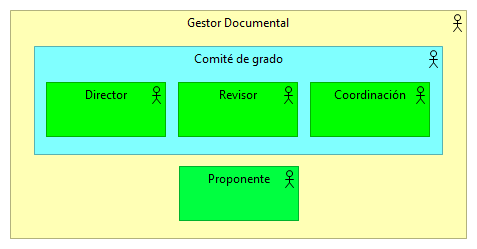
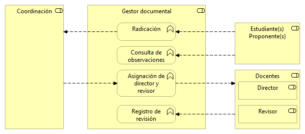
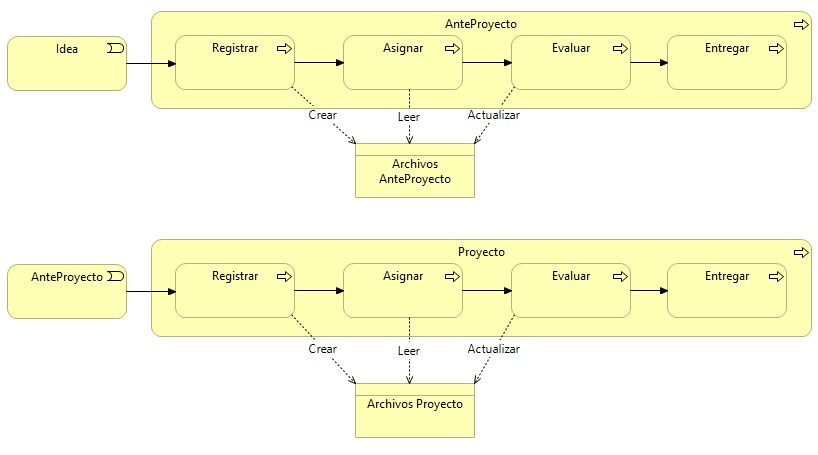

# Ejercicio Diagramas en Archimate

## Integrantes
* Laura Alejandra Campos - 20201099028
* Steven Fabián Gómez - 20201099030
* César Augusto Gómez - 20201099031
* Edna Nayibe Palma - 20201099041

## Objetivo de la solución
Elaboración de 3 puntos de vista en Archimate para un sistema que permita realizar la gestión correspondiente a la revisión y seguimiento de proyectos de grado en la universidad Distrital Francisco José de Caldas.

## Punto de vista de la organización

## Punto de vista de las funciones de negocio

## Punto de vista del proceso de negocio

