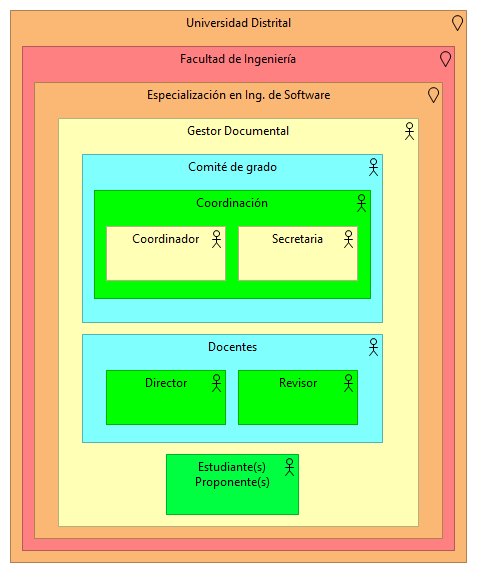

# Ejercicio Diagramas en Archimate

## Integrantes
* Laura Alejandra Campos - 20201099028
* Steven Fabián Gómez - 20201099030
* César Augusto Gómez - 20201099031
* Edna Nayibe Palma - 20201099041

## Objetivo de la solución
Elaboración de 3 puntos de vista en Archimate para un sistema que permita realizar la gestión correspondiente a la revisión y seguimiento de proyectos de grado en la universidad Distrital Francisco José de Caldas.

## Punto de vista de la organización

## Punto de vista de las funciones de negocio

## Punto de vista del proceso de negocio

## Punto de vista de la estructura de la aplicación

## Punto de vista del uso de la aplicación

## Análisis sobre la importancia de la arquitectura de 2 puntos de vista (Layered Viewpoint y Landscape Map Viewpoint) frente a la problemática que se tiene sobre el desarrollo de software en a las metodologías ágiles:

### Layered Viewpoint
Generalmente el desarrollo de la arquitectura en las metodologías ágiles es una practica poco común porque no se considera como una actividad relevante, debido a que la mayoría de las veces es asociado con retrasos en el proyecto de software, por lo que la realizan a medida que evoluciona el proyecto. Sin embargo, se ha comprobado que el diseño de la arquitectura debe realizarse al inicio del proyecto y que si no se cumplen las condiciones de diseño, al realizar correcciones en etapas tardías de desarrollo esto incrementará el costo del proyecto. Por lo anterior, es importante tener una curva de conocimiento con todos los miembros del equipo.

Adicionalmente, a partir del modelo de capas Layered Viewpoint se puede resolver la necesidad de cualquier stakeholder de entender el propósito de un sistema y su implementación de una forma más simple. Además,este modelo es muy útil para el arquitecto ya que le permite analizar la coherencia de los elementos haciendo mas fácil una interacción entre las metodologías ágiles y la arquitectura del software.

### Landscape Map Viewpoint
Las empresas apuestan por una transformación digital donde se determina implantar y desarrollar metodologías agiles en el interior de sus áreas para entregar sus productos con mayor calidad y con unos costes y tiempos muchos mas reducidos. 
Debido a la carencia de mejores prácticas se crea la necesidad de buscar e implantar metodologías agiles en su empresa involucrando a cada uno de sus actores de forma directa lo que permite sumar experiencia y conocimiento.
Por otro lado, cabe destacar que la importancia se ve determinada además por los del punto de vista por ejemplo Map Viewpoint es una matriz que representa unas coordenadas tridimensionales las dimensiones se pueden elegir desde la arquitectura vigente que se este modelado lo que proporciona una manera practica de restablecer y utilizar los conceptos de Archimate aunque no todos los determinados en la notación estándar de estos conceptos. 
Para este punto de vista es importante saber que el nivel general de abstracción está basado en la visión general partiendo que el propósito es decidir sobre las partes interesadas Arquitectos empresariales, altos directivos: CEO, CIO lo que permite además trabajar con mayor velocidad y eficiencia. 
Todos estos conceptos se relacionan de acuerdo que en medios de este trabajo y de las entregas de productos parciales, es posible entregar en el menor intervalo de tiempo posible una versión mucho más funcional del producto.

## Punto de vista de uso de infraestructura

