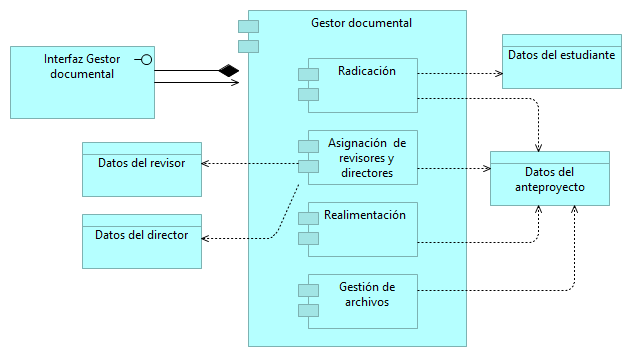

# Ejercicio Diagramas en Archimate

## Integrantes
* Laura Alejandra Campos - 20201099028
* Steven Fabián Gómez - 20201099030
* César Augusto Gómez - 20201099031
* Edna Nayibe Palma - 20201099041

## Objetivo de la solución
Elaboración de 3 puntos de vista en Archimate para un sistema que permita realizar la gestión correspondiente a la revisión y seguimiento de proyectos de grado en la universidad Distrital Francisco José de Caldas.

## Punto de vista de la organización

## Punto de vista de las funciones de negocio

## Punto de vista del proceso de negocio

## Punto de vista de la estructura de la aplicación

## Punto de vista del uso de la aplicación

## Análisis sobre la importancia  de la arquitectura de 2 puntos de vista(Layered Viewpoint y Landscape Map Viewpoint) frente a la problemática que se tiene sobre el desarrollo de software en a las metodologías ágiles:

Generalmente el desarrollo de la arquitectura  en las metodologías ágiles  es una practica poco común porque no se considera como una actividad relevante, debido a que la mayoría de las veces es asociado con retrasos en el proyecto de software, por lo que la realizan a medida que evoluciona el proyecto. Sin embargo, se ha comprobado que el diseño de la arquitectura debe realizarse al inicio del proyecto y que si no se cumplen las condiciones de diseño, al realizar correcciones en etapas tardías de desarrollo esto incrementará el costo del proyecto. Por lo anterior, es importante tener una curva de conocimiento con todos los miembros del equipo.

Adicionalmente, a partir del modelo de capas Layered Viewpoint se puede resolver la necesidad de cualquier stakeholder de entender el propósito de un sistema y su implementación de una forma más simple. Además,este modelo es muy útil para el arquitecto ya que le permite analizar la coherencia de los elementos haciendo mas fácil una interacción entre las metodologías ágiles y la arquitectura del software.

## Punto de vista de uso de infraestructura
